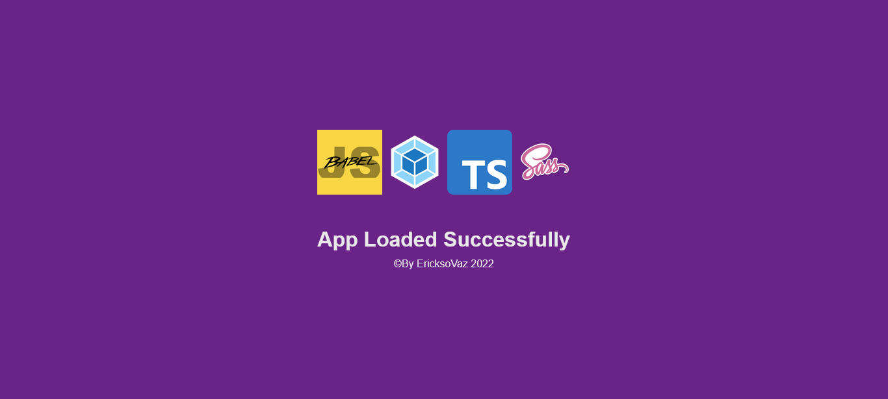

# Webpack Starter Builder

This is a starter builder that takes ts, html, images and sass files and generates a bundle for production, this project has as main objective to evaluate my knowledge in using webpack together with its plugins and loaders

## Dependencies and tools used

This starter made use of more than 20 dependencies, all are listed in package.json

---

### How to use

To use this project follow these steps

1. Clone this repository on your computer
1. Run `npm i` command to install dependencies
1. Build
   - To run in development mode, run the command `npm start`
   - To get the bundle for production run `npm run build`

 

### Screen Shot app loaded

 

